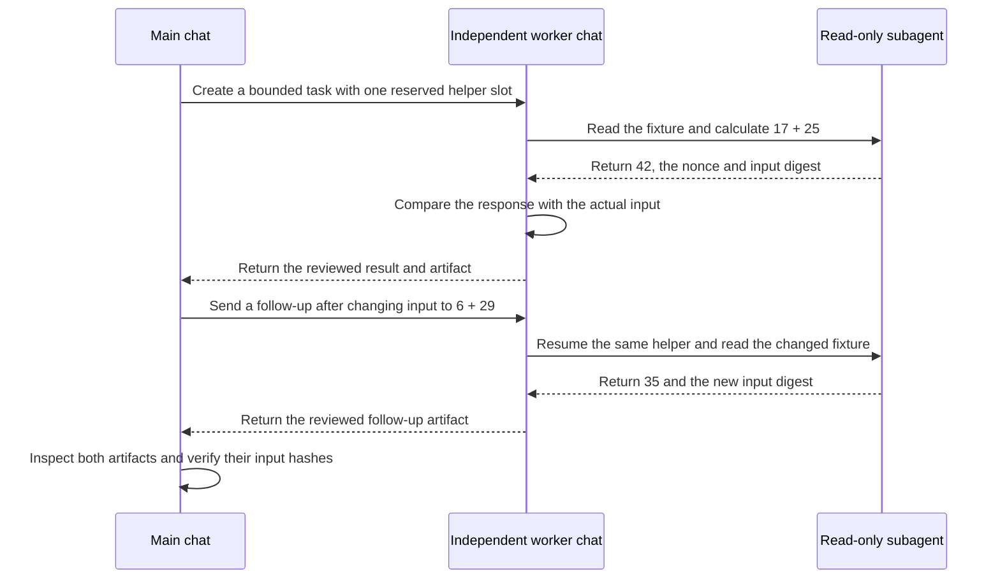
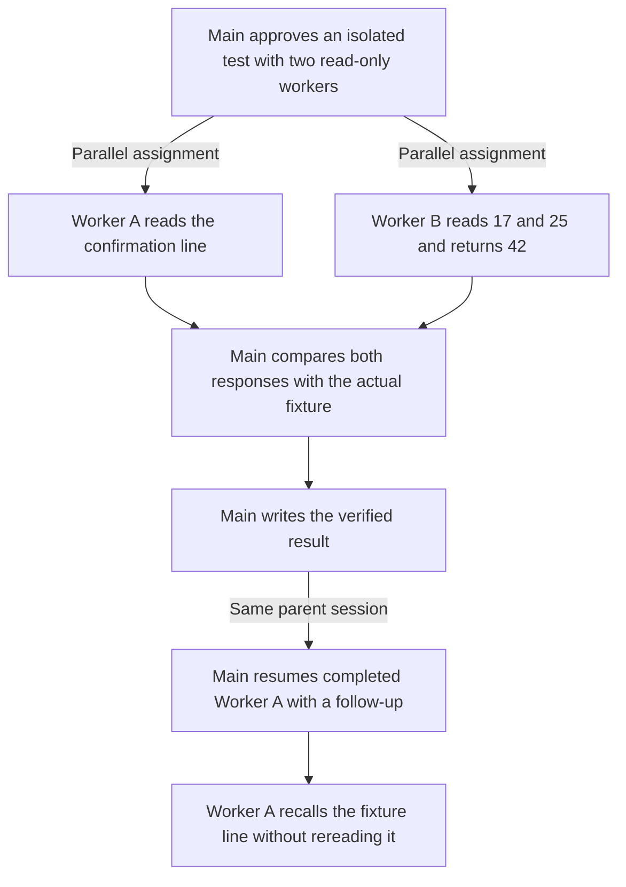

# Observed examples / 검증 예시

The following examples come from the isolated validation run on 2026-10-03. They illustrate observed behavior and retain the limits recorded in [validation status](validation.md). Fixture values are public demonstration inputs; personal paths, session IDs and raw transcripts are omitted.

아래는 이번 프로젝트를 만들면서 실제로 수행한 격리 검증 예시입니다. 실제 도구로 실행한 부분과 가정 입력으로 판정만 확인한 부분을 구분했습니다.

## Codex: independent chat with bounded subagent assistance

메인이 별도 작업 대화를 만들고, 작업 대화가 읽기 전용 서브에이전트 한 명에게 입력 확인과 계산을 맡겼습니다. 작업 대화는 자식의 응답을 실제 입력 파일과 대조한 뒤 결과를 저장했습니다. 메인도 결과 파일과 입력 해시를 확인했습니다.

최초 입력 `17 + 25`의 결과는 `42`였습니다. 후속 요청에서 입력을 `6 + 29`로 바꾸자 같은 작업 대화가 같은 서브에이전트를 다시 사용해 `35`를 반환했습니다. 최초 확인 문구는 후속 요청에 다시 넣지 않았으며, 대화 맥락에서 유지되는 것을 확인했습니다.

확인된 범위는 별도 대화 생성·조회·대기·후속 지시, 그 대화 안의 서브에이전트 생성·결과 수집·동일 자식 후속 실행, 산출물 검토입니다. 주 작업자와 보조 작업자의 합계 한도는 2였고, 보조 슬롯은 1이었습니다. 자식은 읽기 전용이며 하위 위임은 금지했습니다. 앱 재시작 이후 복구나 모델 변경은 이 시험에서 확인하지 않았습니다.

## ZCode: two parallel workers and same-worker follow-up

사용자가 ZCode에서 설치된 스킬로 시험을 실행했습니다. 메인은 읽기 전용 Explore 작업자 두 명을 병렬 배정했습니다. 한 작업자는 확인 문구가 담긴 줄을 읽고, 다른 작업자는 `17`과 `25`의 합계 `42`를 반환했습니다. 메인은 실제 입력과 두 응답을 대조해 결과 파일을 작성했습니다. 결과를 공유받은 뒤 입력·결과 파일을 직접 다시 읽어 내용이 일치하는 것도 확인했습니다.

실제 보고된 도구 흐름은 `Agent` 두 번의 생성, 완료된 동일 작업자에 대한 `SendMessage`, 그리고 `TaskOutput`의 완료 결과였습니다. 재개된 작업자는 파일을 다시 읽지 않고 기존 맥락에서 응답했습니다.

이때 문구만 요청했는데 전체 입력 줄을 반환했습니다. 동일 작업자 재개는 작동했지만 정확한 문구만 반환하는 출력 형식에는 제한이 있었습니다. 클라이언트 버전은 미확인이고, 같은 부모 세션 안에서의 재개만 확인했습니다. 예약 실행은 시험 범위에서 제외했습니다.

## Review and scheduling decision scenarios

완료·의존성·소유권·한도 판정은 아래 가정 입력으로 확인했습니다. 실제 동시 쓰기 충돌이나 전체 보완·재검토 실행을 시험한 것은 아닙니다.

| 입력 상황 | 관찰한 판정 | 증거 범위 |
| --- | --- | --- |
| 작업자가 완료/idle이라고 하지만 결과 파일이 없음 | 완료 승인 대신 근거 보완이 필요하다고 판단 | Codex에서 파일 부재를 실제 확인하고 판정; ZCode는 가정 질문에 응답 |
| 선행 결과가 아직 검토·승인되지 않음 | 그 결과를 필요로 하는 후속 작업 보류 | 판정만 확인 |
| 실행 중인 작업자가 소유한 파일을 다른 작업자도 쓰려 함 | 동시 쓰기 금지; 대기·소유권 조정·별도 파일 중 적절한 조치 제안 | Codex 판정만 확인 |
| 한도 2에 활성 작업자 2명이 있는 상태에서 추가 위임 요청 | 슬롯이 확보될 때까지 새 작업자 생성 보류 | Codex 판정만 확인 |

논의 단계에서는 두 환경 모두 작업자를 생성하지 않았습니다. 실행 요청 이후에만 위임했고, 작업자의 완료 주장은 검토 시작 신호로 취급했습니다.

## Use this flow for your own work

프로젝트에서는 계산 시험 대신 실제 산출물과 완료 기준을 지정하면 됩니다. 예를 들어 독립적으로 이어갈 구현 작업은 Codex의 별도 대화가 맡고, 그 대화가 기존 흐름 조사나 변경 검토를 제한된 서브에이전트에 맡길 수 있습니다. ZCode에서는 메인이 서브에이전트 작업자를 직접 조정합니다. 이 활용 예시는 제품의 의도된 사용 방식이며, 위에서 실행한 검증 사례와 구분합니다.
